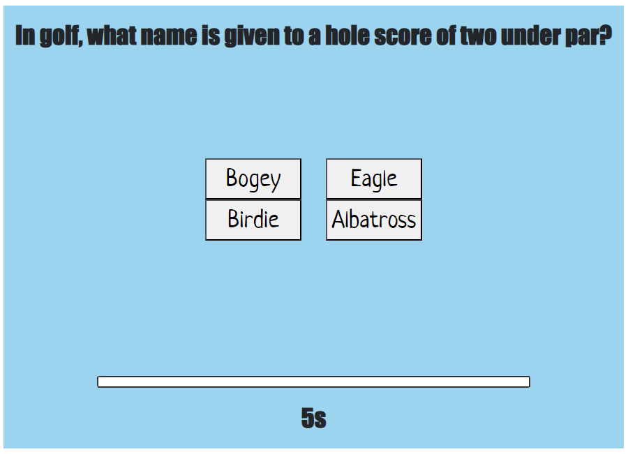
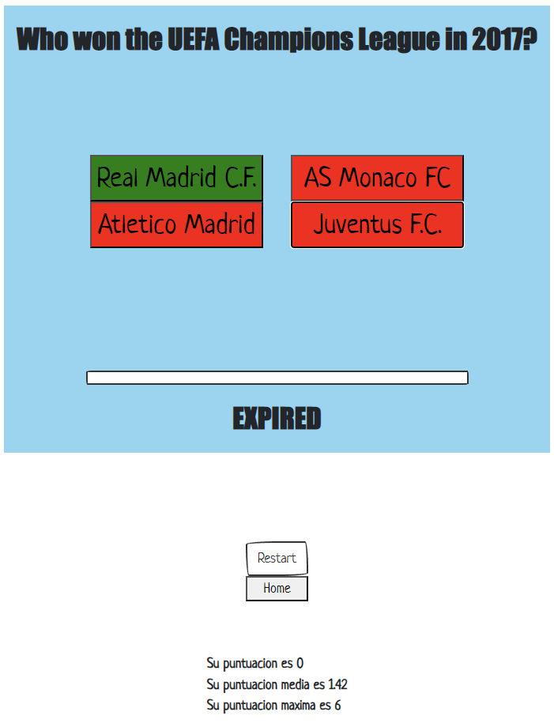
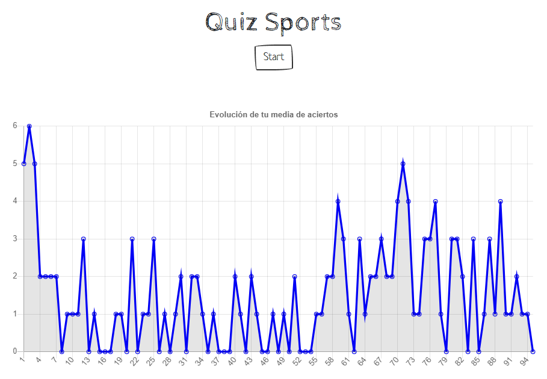

# QUIZ SPORTS

_Sports Quiz es un proyecto de trivial interactivo en el que se demuestran conocimientos en el ámbito deportivo. La idea fundamental es que el usuario conteste a las preguntas del quiz y al final vea su puntuación y su media de respuestas_
___
## Objetivos 🚀

El proyecto consiste en desarrollar un cuestionario, capaz de mostrar los resultados erróneos y correctos.
* El Quiz constará de 10 preguntas. Cada pregunta tendrá 4 opciones y sólo una de ellas será la correcta.

* Las preguntas vendrán de: https://opentdb.com/

* La aplicación tendrá que ser una SPA (single-page application). Sólo una pregunta cada vez en pantalla.
***
### Requisitos 📋

* Manipulación dinámica del DOM

* Crear una página SPA para las preguntas

* Manejo de ES6

* Asincronía. Usar API de preguntas https://opentdb.com/

* APIs HTML5: Uso de Local storage , gráficas

* Sin frameworks y librerías externas en la medida de lo posible. Salvo frameworks de CSS como Bootstrap

* Gestión del proyecto desde el inicio en un único repositorio compartido (como colaboradores) en Github

* Código limpio, buenas prácticas

___


## Ejecutando las pruebas ⚙️

A continuación, se mostrarán distintas imágenes de las funcionalidades del juego en la interacción de usuario.

Primeramente, la imagen de la página principal en la que vemos el título y el botón "start" para comenzar.


Al pulsar "start" se muestra la primera pregunta con las cuatro opciones y hemos añadido un temporizador de 10 segundos en el que si no se responde a la pregunta en ese tiempo se pasará a la siguiente.



Conforme avanzamos en el cuestionario se observa como se van coloreando las respuestas según sea correcta o incorrecta.

También hemos añadido una función para que al terminar el cuestionario aparezcan la media y puntuación maxima por cada vez que se juega. También reaparece el botón de "Restart" y el botón de "Home". 



Por último, en la sección de "Home" aparece una gráfica de la evolución del número de aciertos cada vez que se juega a Quiz Sport
y el botón de "start" para volver a jugar.



---

### Temas de Bootstrap 🔩

En cuanto al estilo, hemos aplicado nuestra propia hoja de estilos con CSS, algunas clases de Bootstrap y hemos añadido un tema también de Bootstrap. Para aplicarlo hemos linkeado en el HTML el enlace que nos descargamos cuando elegimos el tema.

```html
<link rel="stylesheet" href="./styles/bootstrap.min.css">
```
---
## Construido con 🛠️

* [JavaScript](https://developer.mozilla.org/en-US/docs/Web/javascript)
* [Bootstrap](https://getbootstrap-com.translate.goog/?_x_tr_sl=en&_x_tr_tl=es&_x_tr_hl=es&_x_tr_pto=sc)
* [Axios](https://axios-http.com/es/docs/intro)
* [Visual Studio Code](https://code.visualstudio.com/)
* HTML
* CSS
---
## Autores ✒️

* **Francisco Niederleytner** - [Pacool](https://github.com/pacool1234)
* **Jose Llanas** - [jllanas1986](https://github.com/jllanas1986)
